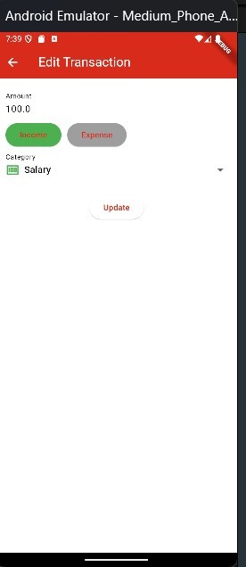
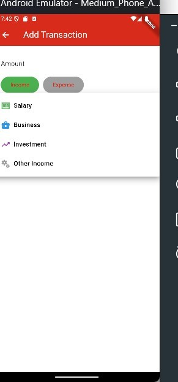
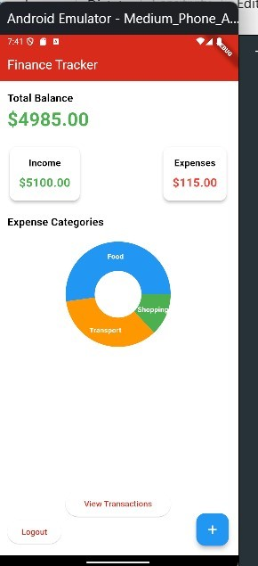
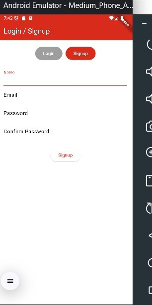

📌 Finance App – Manage Your Finances Seamlessly 💰📊
🚀 Finance App is a modern Flutter application that helps you track your income, expenses, and savings efficiently. With Firebase Authentication and Firestore Database, your financial data is secure and accessible anytime.

📷 App Screenshots

📌 Home	📊 Analytics	💳 Transactions
	
✨ Features

✅ Firebase Authentication – Sign in with Email/Google
✅ Firestore Database – Securely store transactions
✅ Expense & Income Tracking – Categorized transactions
✅ Real-time Charts – Visual insights for better management
✅ Dark Mode Support – Switch between light & dark themes
✅ Multi-Currency Support – Set preferred currency

🛠 Tech Stack

Flutter – Cross-platform UI framework
Dart – Programming language
Firebase Authentication – User login & authentication
Cloud Firestore – Database for storing transactions
Provider / Riverpod – State management
